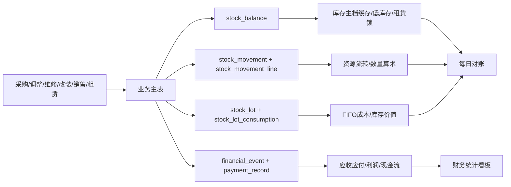

# ERP 数据计算与持久化测试报告

测试日期：2026-08-03（Asia/Shanghai）  
测试对象：`forklift-erp 0.2.0-rc.1`，当前工作树源码  
数据库级测试库：`forklift_erp_test_202608030001`（本地 MySQL 8.0.43 隔离库）

## 1. 结论摘要

本轮测试未发现已经发生的库存负数、台账算术错误、FIFO数量/成本越界、主档库存缓存不一致、出库收款不一致或迁移异常。默认Java测试、前端检查、Vitest、真实MySQL业务集成测试和本地MySQL迁移升级测试均通过。

但源码中存在几项需要在发布前处理或补强的计算一致性风险：

1. 库存价值报表使用 `remaining_quantity * unit_cost`，而FIFO的权威值是 `remaining_cost_amount`；分摊尾差时可能出现库存价值与FIFO账面不一致。
2. 出库单修改时，销售成本从六位平均单价乘数量重算，而不是直接使用出库流水的权威 `cost_amount`；大数量或多批次FIFO场景可能出现一分钱级别的修订差异。
3. 采购单允许同时提交互相矛盾的 `quantity * unitPrice` 与 `totalAmount`，系统静默采用显式总额，采购展示、应付和入库成本可能出现口径分歧。
4. 出库单允许显式 `lineAmount/receivableAmount` 与 `unitSalePrice * quantity` 不一致；订单、库存流水、财务事件和不同统计路径可能使用不同金额。
5. 财务统计对未知 `source_type` 采用“归入改装收入/费用”的兜底规则，新业务类型增加后有误分类风险。

## 2. 测试执行结果

| 测试层 | 命令/范围 | 结果 |
|---|---|---|
| Java默认测试 | `.\mvnw.cmd test "-Dfrontend.skip=true"` | 226/226通过，0失败、0错误、0跳过 |
| 前端质量 | `npm.cmd run check` | 通过 |
| 前端单元 | `npm.cmd run test:unit` | 17/17通过；语句98.54%、分支85.41%、函数100%、行98.54% |
| Java覆盖率门禁 | `java scripts/CheckCoverageBaseline.java` | 通过；指令34.8656%、分支29.7924%、行36.8390%、方法36.5245% |
| MySQL业务集成 | 18个集成测试类，覆盖采购、库存/FIFO、出库、支付、租赁、维修、改装、统计、对账、导入、幂等 | 60/60通过，0失败、0错误、0跳过 |
| Flyway历史升级 | 本地MySQL执行 `localMysqlV18AndV36SnapshotsUpgradeThroughV51` | 1/1通过；V18→V36→V40→V51升级、预检异常识别、约束和回填断言均通过 |
| 数据库不变量 | 隔离库SQL核对 | 11类不变量全部0条异常；V51；OPEN迁移异常0条 |

数据库不变量包括：库存余额非负、流水 `after = before + delta`、流水前后数量非负、FIFO数量/金额边界、FIFO消费成本容差、配件/整车主档与可用库存缓存、出库收款与支付事实、已过账租赁账单与收入事件、活动租赁与锁定库存。

未执行的测试：`StockMovementReversalLineMigrationTests` 的2个Docker专用方法。该类直接硬编码启动Testcontainers，当前机器Docker daemon未运行；V51主升级测试已通过本地MySQL替代路径，但这2个“V50历史回填/未来错误明细拒绝”场景仍应在CI或Docker可用环境补跑。

## 3. 核心数据公式与联动

### 3.1 金额和数量通用规则

- 非法金额归一：`null`或负数通常归零；财务事件最终按2位小数 `HALF_UP` 保存，支付金额超过2位小数则拒绝。
- 入库数量：`before = current ?? 0`，`after = before + quantity`，数量必须大于0。
- 出库数量：`after = before - quantity`，数量必须大于0且库存足够。
- 调整数量：`delta = target - before`，实际影响数量为 `abs(delta)`，最终数量为 `target`。
- 流水算术：`quantity_delta = after_quantity - before_quantity`。

主要实现：`D:\work\erp\forklift_erp-codex-tested-local-snapshot\src\main\java\com\example\forklift_erp\util\InventoryQuantities.java`、`D:\work\erp\forklift_erp-codex-tested-local-snapshot\src\main\java\com\example\forklift_erp\service\StockLedgerService.java`。

### 3.2 库存、仓库和FIFO

| 数据 | 计算公式/规则 | 主要联动 |
|---|---|---|
| 仓库可用库存 | 入库 `available += q`；出库 `available -= q`；调拨源仓 `-q`、目标仓 `+q` | `stock_balance`、`stock_movement`、`stock_movement_line` |
| 租赁锁定 | 租出 `available -= q, locked += q`；归还 `available += q, locked -= q` | `rental_record`、整车状态、租赁对账 |
| 主档库存缓存 | 配件 `part.quantity = Σ stock_balance.available_quantity`；整车 `machine.inventory_count = Σ available_quantity` | 列表、低库存、统计和删除保护 |
| 入库批次总成本 | 有显式总成本则使用显式值，否则 `round(unitCost * quantity, 2)`；运费单独保存 | `stock_lot.original/remaining_cost_amount`、采购应付 |
| FIFO批次分摊 | 整批：`allocated = remainingCost`；部分批次：`round(remainingCost * used / remainingBefore, 2)` | `stock_lot_consumption.total_cost`、出库/维修/改装成本 |
| FIFO平均单价 | `unitCost = abs(Σ consumption.total_cost) / quantity`，保留6位小数 | 仅作平均快照；金额总额应以`total_cost/cost_amount`为准 |
| 盘点调整 | 增加：`totalCost = fallbackUnitCost * abs(delta)`；减少：按FIFO消费得到`totalCost` | 库存流水、批次、审计、`INVENTORY_GAIN/LOSS`财务事件 |

FIFO实现：`D:\work\erp\forklift_erp-codex-tested-local-snapshot\src\main\java\com\example\forklift_erp\service\StockLotService.java`、`D:\work\erp\forklift_erp-codex-tested-local-snapshot\src\main\java\com\example\forklift_erp\service\StockLotCostAllocator.java`。

### 3.3 采购

- 采购总额：有请求总额时 `totalAmount = request.totalAmount`，否则 `unitPrice * quantity`。
- 采购应付：`payable = totalAmount + freightAmount`。
- 入库含运单价：`landedUnitCost = payable / quantity`，保留6位小数。
- 收货联动：创建FIFO批次、库存入库流水、更新配件/整车库存主档、过账 `ACCOUNTS_PAYABLE`、记录收货移动和幂等键。
- 取消/撤销收货：要求批次仍可逆，反向库存流水和反向财务事件必须同时成功。

实现：`D:\work\erp\forklift_erp-codex-tested-local-snapshot\src\main\java\com\example\forklift_erp\service\PurchaseOrderService.java`。

### 3.4 出库销售和应收

- 单价选择：按请求 `unitSalePrice → settlementPrice → salePrice → 主档价格` 取第一个非负值。
- 行金额：按请求 `lineAmount → receivableAmount` 取显式值；无显式值时 `unitSalePrice * quantity`。
- 应收：`receivableAmount = lineAmount`。
- 收款：`receivedAmount = Σ payment_record(RECEIPT)`；未收金额为 `max(receivable - received, 0)`。
- 结清：收款达到应收时 `paymentSettled = true`；显式结清还会把收款目标补到应收。
- 毛利：`grossProfit = lineAmount - FIFO total cost`。
- 出库联动：扣减仓库和主档、消费FIFO、写出库流水/库存移动、过账收入和销售成本、同步支付事实及审计记录。

实现：`D:\work\erp\forklift_erp-codex-tested-local-snapshot\src\main\java\com\example\forklift_erp\service\impl\OutboundOrderServiceImpl.java`、`D:\work\erp\forklift_erp-codex-tested-local-snapshot\src\main\java\com\example\forklift_erp\service\impl\OutboundStockAccountingService.java`、`D:\work\erp\forklift_erp-codex-tested-local-snapshot\src\main\java\com\example\forklift_erp\service\impl\OutboundReceivablePolicy.java`。

### 3.5 维修

- 维修配件收费：`chargeAmount = chargeUnitPrice * quantity - discountAmount`，折扣不得超过行金额。
- 维修应收：`repairFee + partsFee + passThroughAmount`。
- 外协费用：仅 `repairExternal = true` 时计入 `repairExpense`。
- 配件成本：结构化配件明细通过FIFO消费，`partsCost = Σ FIFO total_cost`。
- 财务：应收和收入各过账维修应收额；配件FIFO成本过账销货成本；外协费用过账经营费用。

实现：`D:\work\erp\forklift_erp-codex-tested-local-snapshot\src\main\java\com\example\forklift_erp\service\impl\RepairPartUsageService.java`、`D:\work\erp\forklift_erp-codex-tested-local-snapshot\src\main\java\com\example\forklift_erp\service\impl\RepairRecordServiceImpl.java`。

### 3.6 租赁

- 月度租金：对每个自然月按含首尾日期计费：`monthlyAmount = monthlyPrice * daysInSegment / daysInMonth`，每月2位小数 `HALF_UP`。
- 已归还租赁：结束日取 `returnDate`，缺失时取`endDate`。
- 进行中租赁：结束日取测试当天日期；账单刷新只生成截至上一个完整月的账单。
- 最终账单：生成到归还日/结束日，按 `rental_id + bill_period` 幂等；每张已过账账单生成应收和收入事件。

实现：`D:\work\erp\forklift_erp-codex-tested-local-snapshot\src\main\java\com\example\forklift_erp\service\RentalRevenueCalculator.java`、`D:\work\erp\forklift_erp-codex-tested-local-snapshot\src\main\java\com\example\forklift_erp\service\RentalBillingService.java`。

### 3.7 改装

- 改装收费：`gross = chargeUnitPrice * quantity`，`chargeAmount = gross - discountAmount`。
- FIFO改装成本：每条新配件明细取其FIFO消费总成本。
- 旧件回库价值：当旧件处置为入库时，`returnedValue = oldPartUnitCost * quantity`。
- 资本化金额：`capitalizationAmount = newPartFifoCost - returnedValue`；售前改装加到整车 `landedUnitCost`。
- 售后财务：收费计应收/收入，FIFO成本计经营费用，旧件回收计库存收益。

实现：`D:\work\erp\forklift_erp-codex-tested-local-snapshot\src\main\java\com\example\forklift_erp\service\ModificationAccountingService.java`、`D:\work\erp\forklift_erp-codex-tested-local-snapshot\src\main\java\com\example\forklift_erp\service\impl\ModificationWorkOrderServiceImpl.java`。

### 3.8 财务统计

当前生产统计入口是 `StatisticsProjectionRepository → StatisticsProjectionMapper`，以已过账 `financial_event` 和库存移动事实为来源：

- `totalIncome = outboundRevenue + repairIncome + rentalIncome + modificationIncome + inventoryGain`
- `totalExpense = outboundCost + repairExpense + repairPartsCost + modificationExpense + inventoryLoss`
- `grossProfit = netProfit = totalIncome - totalExpense`
- `netCashflow = Σ CASH_RECEIPT - Σ CASH_PAYMENT`
- 入库数量和入库成本来自正向库存移动；出库收入/成本来自财务事件及出库移动行。
- 年度统计是月份事实按年份求和；财务事件反向冲销使用负数事实，不删除原始事实。

实现：`D:\work\erp\forklift_erp-codex-tested-local-snapshot\src\main\java\com\example\forklift_erp\repository\StatisticsProjectionRepository.java`、`D:\work\erp\forklift_erp-codex-tested-local-snapshot\src\main\java\com\example\forklift_erp\service\StatisticsProjectionMapper.java`、`D:\work\erp\forklift_erp-codex-tested-local-snapshot\src\main\java\com\example\forklift_erp\service\StatisticsService.java`。

## 4. 数据联动主链路

可靠性机制：业务服务使用事务；关键资源使用悲观锁或乐观版本；库存、支付、批次和请求均有幂等键；V43-V51增加了数量、金额、外键、反向流水和唯一约束；迁移异常通过`migration_exception`暴露给统计看板。

## 5. 发现的问题和改进建议

### P1：库存价值报表没有使用FIFO权威剩余成本

证据：`D:\work\erp\forklift_erp-codex-tested-local-snapshot\src\main\java\com\example\forklift_erp\repository\StatisticsProjectionRepository.java:310`和`:349`使用 `SUM(remaining_quantity * unit_cost)`；而迁移说明和FIFO实现明确把 `remaining_cost_amount`作为权威金额，`unit_cost`只是6位平均值。

影响：多次消费、数量较大或出现分摊尾差时，库存成本价值可能与FIFO账面差一分钱或更多；库存价值报表、出库成本和对账可能不一致。

建议：改为 `SUM(remaining_cost_amount)`；增加SQL不变量 `remaining_cost_amount = 0 when remaining_quantity = 0` 和库存价值与FIFO金额的直接对账；补充数量9,999、10,000、20,001及多批次测试。

### P1：出库单修改成本从平均单价重建，不够权威

证据：`D:\work\erp\forklift_erp-codex-tested-local-snapshot\src\main\java\com\example\forklift_erp\service\impl\OutboundOrderServiceImpl.java:653-661`以 `stock_operation_log.unit_cost * order.quantity`重算；而同文件`:624-627`已经把FIFO精确总成本写入库存移动行的`costAmount`。

影响：首次出库使用精确FIFO成本，修改销售价格或其他字段触发冲销重过账时可能使用平均单价重建成本，导致前后财务事件成本不完全相同。

建议：修改时按该出库来源的库存移动行汇总`cost_amount`，只在历史数据缺失时使用平均成本，并同时写入可见的数据警告。

### P1：采购显式总额与数量/单价不一致时静默接受

证据：`D:\work\erp\forklift_erp-codex-tested-local-snapshot\src\main\java\com\example\forklift_erp\service\PurchaseOrderService.java:584-591`只要请求带`totalAmount`就直接采用，不校验 `totalAmount = quantity * unitPrice`。

影响：采购列表总额、采购单价、应付金额、FIFO入库含运成本可能表达不同业务口径；录入错误不会被发现。

建议：明确`totalAmount`是“含折扣行总额”还是必须由单价计算；若两者同时提供，应保存折扣/差额字段并校验关系，或直接拒绝超出容差的矛盾输入。

### P1：出库显式行金额与单价存在两套来源

证据：`OutboundOrderServiceImpl.resolveLineAmount`优先接受显式`lineAmount/receivableAmount`，但库存流水最终又把`unitSalePrice`写入`unitRevenue`；`FinancialEventService.salesAmount`优先使用`lineAmount`。这使订单金额、库存日志统计、财务事件在不一致输入下可能分叉。

影响：例如数量3、单价100、显式行金额280时，应收/财务收入为280，但依赖日志单价的旧统计路径可能计算为300。

建议：只保留一个销售金额权威来源：建议保存行总额和数量，单价由总额/数量派生并明确舍入；或校验 `lineAmount = unitSalePrice * quantity`，把折扣、税费作为独立字段。

### P2：未知财务来源类型会被归入改装

证据：统计SQL把 `source_type NOT IN ('OUTBOUND_ORDER','REPAIR','RENTAL_BILL')` 的收入归到`modification_income`，成本也使用排除式归类；Java事件统计的`default`分支同样把未知收入按改装处理。

影响：新增业务来源或数据修复来源未同步修改统计SQL时，会污染改装收入/费用和改装订单数。

建议：改为明确白名单 `MODIFICATION_WORK_ORDER`，未知来源单独进入`unclassified`并产生数据警告；将事件类型和来源类型改为数据库/代码常量约束。

### P2：存在重复的历史统计计算器，公式口径容易漂移

`FinancialStatisticsBuilder`仍维护一套按库存日志、维修、租赁、改装计算的统计公式，而生产入口现在使用财务事件投影。两套实现对入库成本、现金流和金额快照的处理方式不同，虽然当前测试都通过，但未来重新接入旧计算器会出现报表差异。

建议：保留财务事件投影作为唯一生产口径；将旧计算器标为迁移兼容代码并减少重复公式，或增加“旧路径 vs 事件路径”的同库双算对账测试。

### P2：租赁列表汇总与财务看板的“收入”语义不同

租赁列表使用按日期实时摊销的 `RentalRevenueCalculator.totalAmount`；财务看板和Top Rentals使用已过账的`rental_bill`。进行中的租赁可能在列表显示累计租金，但尚未出现在已过账财务收入中。

建议：前端字段明确区分“应计租金/预计收入”和“已过账收入”，或让列表也只统计已过账账单。

### P2：V51明细级迁移测试依赖Docker，降低本地复核能力

`D:\work\erp\forklift_erp-codex-tested-local-snapshot\src\test\java\com\example\forklift_erp\StockMovementReversalLineMigrationTests.java`直接创建Testcontainers，未复用已支持外部MySQL的配置。

建议：像`FlywayUpgradeIntegrationTests`一样增加本地隔离MySQL分支，或在CI保证Docker可用；该测试应纳入发布门禁。

## 6. 后续建议的测试补充顺序

1. 先修/验证FIFO权威库存价值和出库修改成本，加入多批次、大数量、尾差、撤销再重做场景。
2. 增加采购和出库金额字段不一致的API测试，明确返回400而不是静默选优先字段。
3. 增加未知财务来源类型测试，要求进入未分类/数据警告而不是改装。
4. 加入同一业务事实的“主档缓存 = 台账投影 = FIFO数量/金额 = 财务事实”SQL巡检任务，并在健康/对账接口暴露异常计数。
5. 补跑V51明细级迁移测试；测试库应在测试后删除或由CI自动回收，业务库禁止执行。
